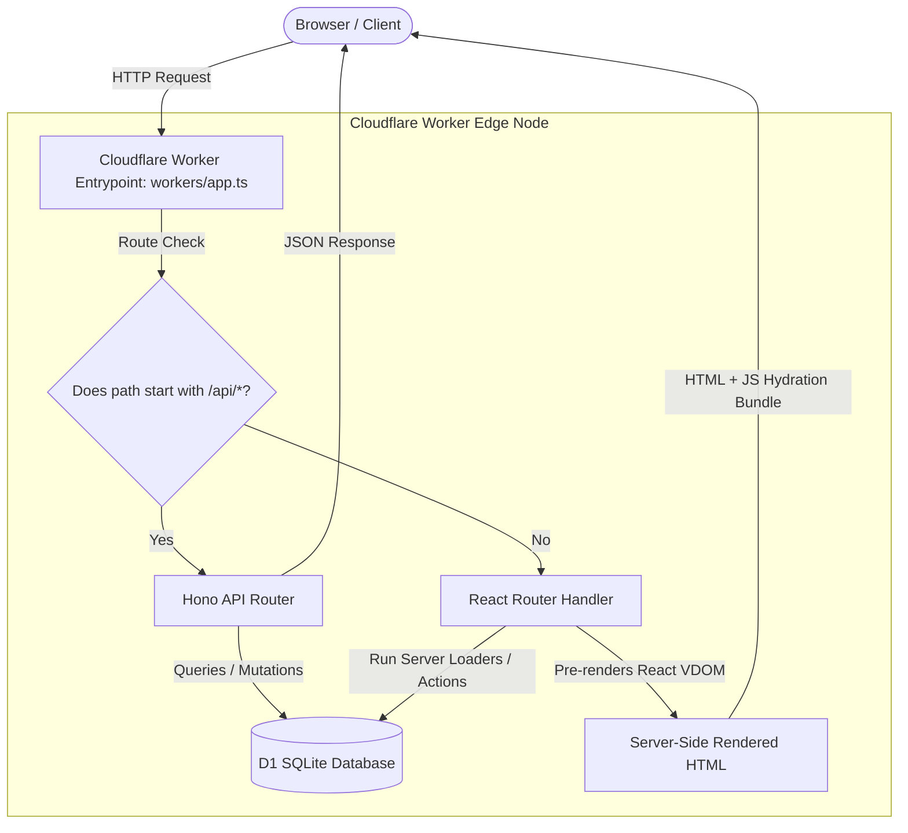

# Co-located React Router v7 (Framework Mode) + Hono Architecture

This architecture integrates **React Router v7 (Framework Mode)** for server-side rendered (SSR) frontend pages and **Hono** for high-performance API routing inside a single, unified Cloudflare Worker deployment.

---

## 🏛️ Architectural Diagram



---

## 🔄 Request Lifecycle & Data Flow

### 1. API Request Path (`/api/*`)
1. **Client Send:** The client sends an HTTP request to `https://example.com/api/contacts`.
2. **Gatekeeper:** The main Worker entrypoint (`workers/app.ts`) receives the request.
3. **Match Route:** The Hono router matches the path `/api/contacts`.
4. **Data Query:** Hono executes a raw SQL statement against the D1 SQLite database via the native binding context `c.env.DB`.
5. **JSON Response:** Hono serializes the array of records and returns a standard JSON payload directly to the client.

### 2. Frontend Page Request Path (`/*` e.g., `/dashboard`)
1. **Client Send:** The user requests `https://example.com/dashboard`.
2. **Gatekeeper:** The entrypoint checks the path. It doesn't start with `/api/*`, so it hands the request to the React Router handler: `reactRouterHandler(c.req.raw, { cloudflare: { env: c.env } })`.
3. **Server Loader:** React Router runs the `loader` function associated with the `/dashboard` route. This loader queries the D1 database using the load context: `context.cloudflare.env.DB`.
4. **SSR Render:** The loader returns the raw dataset to the page component. The server pre-renders the React component tree into a static HTML string.
5. **Delivery & Hydration:** The server returns the HTML document along with Vite's compiled JavaScript hydration bundles. The browser renders the HTML instantly, and then React "hydrates" the page on the client to enable interactive event listeners.

---

## 📁 Standard Directory Structure

```text
my-app/
├── wrangler.jsonc          # Database bindings & Worker configs
├── workers/
│   └── app.ts              # Gatekeeper worker (combines Hono & React Router)
├── app/                    # React Router Frontend
│   ├── routes.ts           # URL path configurations
│   ├── root.tsx            # Global UI layout & layout context
│   └── routes/
│       ├── dashboard.tsx   # Dashboard page with server loader & action
│       └── profile.tsx
├── schema.sql              # Database D1 migrations
└── package.json
```

---

## ⚙️ How Context Bindings are Shared

Because Hono acts as the main server container, the Cloudflare environment bindings (`env`) are injected into Hono first. When routing non-API requests to React Router, we explicitly pass the environment bindings through the `loadContext` parameter:

```typescript
// inside workers/app.ts
app.all('*', async (c) => {
  return reactRouterHandler(c.req.raw, {
    cloudflare: {
      env: c.env, // Access D1, KV, R2, and secrets
      ctx: c.executionCtx
    }
  });
});
```

Within a React Router loader or action, you pull this database binding like this:

```typescript
// inside app/routes/dashboard.tsx
export async function loader({ context }: Route.LoaderArgs) {
  const db = context.cloudflare.env.DB;
  const { results } = await db.prepare("SELECT * FROM stats").all();
  return { stats: results };
}
```

---

## ⚡ Performance & Caching Strategies

*   **Zero Network Overhead:** Loaders query the database internally on the same Cloudflare edge node. There are no external database HTTP network calls, resulting in database queries that execute in under **5ms**.
*   **Static Asset Offloading:** Static files (images, JS, CSS) are handled by Wrangler's asset router and served directly from Cloudflare's cache without ever touching your JS compute budget.
*   **Scale-to-Zero:** The compute runtime spins up on-demand and consumes 0 resources when idle.
