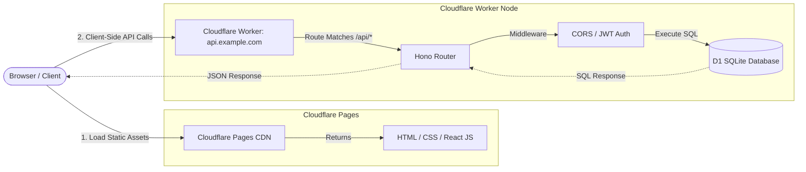

# Decoupled Vite React SPA + Hono API Architecture

This architecture separates the frontend client-only application (**Vite + React SPA**) from the backend service (**Hono API Worker**). The frontend is hosted statically on **Cloudflare Pages**, while the backend API runs independently on **Cloudflare Workers**.

---

## 🏛️ Architectural Diagram



---

## 🔄 Request Lifecycle & Data Flow

### 1. Initial Page Load
1. **Request:** The user enters `https://www.example.com` in the browser.
2. **CDN Delivery:** Cloudflare Pages (acting as a global edge file system) serves `index.html`, compiled JavaScript bundles, and static assets (images, CSS) to the browser.
3. **Mount React:** The browser downloads and executes the JavaScript. React mounts the application onto the DOM.
4. **Client Routing:** The client-side router (`react-router-dom` in library mode) inspects the URL path (e.g., `/dashboard`) and renders the corresponding local React component view.

### 2. Data Fetching (e.g., loading database content)
1. **Client Fetch:** The React component mounts, triggering a standard network `fetch` or `Axios` call to the separate API endpoint: `GET https://api.example.com/contacts`.
2. **Preflight Check (CORS):** The browser sends an `OPTIONS` request. The Hono Worker catches the preflight request, validates that the source domain (`www.example.com`) is allowed, and returns valid CORS headers.
3. **API Execution:** The browser sends the actual `GET` request. Hono processes the route, queries D1 SQLite using `c.env.DB`, and responds with a JSON payload.
4. **State Update:** The React application receives the JSON, updates its local component state (or cache like React Query), and re-renders the UI to display the data.

---

## 📁 Standard Directory Structure (Multi-Repo or Monorepo)

In this architecture, developers often use two completely independent code repositories or a monorepo setup:

```text
my-decoupled-project/
├── frontend/                # Deployed to Cloudflare Pages
│   ├── public/
│   ├── src/
│   │   ├── components/
│   │   ├── pages/           # Client-only page files
│   │   ├── main.tsx         # React app entry
│   │   └── App.tsx          # Client-side router configuration
│   └── package.json
│
└── backend/                 # Deployed to Cloudflare Workers
    ├── wrangler.jsonc       # Worker database bindings
    ├── src/
    │   └── index.ts         # Hono API router & routes
    ├── schema.sql           # Database schema migrations
    └── package.json
```

---

## 🔒 Security & CORS Configuration

Because the frontend and backend are hosted on different domains (or subdomains), **Cross-Origin Resource Sharing (CORS)** must be explicitly configured on the Hono Worker backend:

```typescript
// backend/src/index.ts
import { Hono } from 'hono';
import { cors } from 'hono/cors';

const app = new Hono<{ Bindings: Env }>();

app.use('/api/*', cors({
  origin: ['https://www.example.com', 'http://localhost:5173'],
  allowHeaders: ['Content-Type', 'Authorization'],
  allowMethods: ['GET', 'POST', 'PUT', 'DELETE', 'OPTIONS'],
  exposeHeaders: ['Content-Length'],
  maxAge: 600,
  credentials: true,
}));

app.get('/api/contacts', async (c) => {
  const { results } = await c.env.DB.prepare("SELECT * FROM contacts").all();
  return c.json(results);
});

export default app;
```

---

## ⚖️ Trade-offs: Decoupled vs. Co-located

### Pros:
*   **Decoupled Development:** Frontend teams can iterate, build, and deploy the user interface without running or redeploying backend worker codes.
*   **Simple Local Testing:** You can run your frontend on `http://localhost:5173` and point it to a mock API or staging API worker directly.
*   **Zero Server Hydration Errors:** Because everything is rendered in the browser, you avoid complex server-side hydration mismatches (which can occur during Server-Side Rendering if client and server clocks or structures differ).

### Cons:
*   **CORS Latency:** Every write/read operation from the browser requires an initial CORS preflight request (`OPTIONS`), adding extra network latency.
*   **Initial Page Load Delay (Waterfall):** Users receive an empty white screen while the JavaScript bundles are downloaded and parsed, and a second delay while the client-side `fetch` queries the API.
*   **Poor SEO:** Search engines (especially older bots) struggle to index pages that require client-side execution to load metadata or text.
