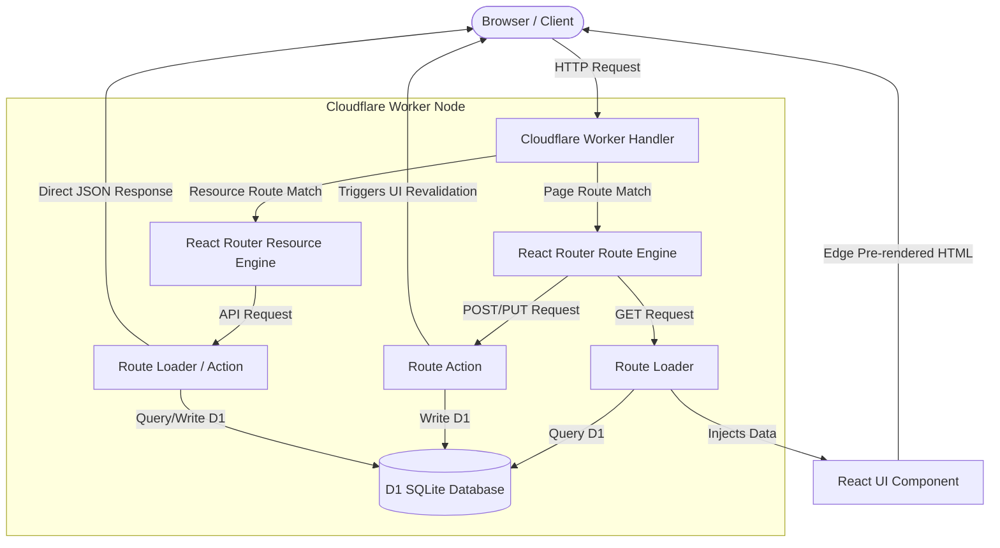

# React Router v7 (Framework Mode) Only Architecture

This architecture uses **React Router v7 (Framework Mode)** as a unified full-stack server-side engine. In this setup, a separate API framework like Hono is not used. Instead, React Router handles both frontend UI rendering and API endpoints natively using **Loaders**, **Actions**, and **Resource Routes**.

---

## 🏛️ Architectural Diagram



---

## 🔄 Request Lifecycle & Data Flow

### 1. Route Loader Flow (Reading Data)
1. **Request:** The user navigates to `/blogs`.
2. **Server Loader Execution:** The React Router engine intercepts the request on the edge node and calls the route's `loader` function.
3. **Database Query:** The `loader` reads D1 bindings directly from the context (`context.cloudflare.env.DB`), pulls database rows, and returns a JSON response.
4. **HTML Rendering:** The React Router rendering engine passes the raw JSON data directly as props into the `/blogs` component, renders the full page to HTML, and sends it to the user.
5. **No Client Waterfall:** The browser renders the database content immediately upon receipt of the HTML document.

### 2. Route Action Flow (Writing Data)
1. **Client Submission:** The user fills out a comment form and submits it. React Router intercepts the browser form submit and sends a `POST` request to `/blogs?_data=routes/blogs` under the hood.
2. **Server Action Execution:** The route's `action` function runs on the server.
3. **Database Write:** The action extracts the form data (`await request.formData()`), validates fields, and runs an SQL `INSERT` statement against D1.
4. **Data Revalidation:** On successful database insertion, the action redirects or returns status data. React Router automatically re-runs the `loader` function for all active page routes to fetch the updated database records.
5. **UI Update:** The React page updates reactively with the new database content, without a full browser reload.

### 3. Resource Route Flow (JSON API Endpoint)
1. **Request:** An external service or mobile app sends a request to `GET /api/status`.
2. **API Loader Execution:** React Router routes this to the resource file `app/routes/api/status.ts`.
3. **Direct Serialization:** The resource route defines only a `loader` function that queries D1 and returns a raw `Response` or `Response.json(data)`.
4. **Clean JSON:** Because the route does not export a default React component, React Router skips HTML rendering entirely and sends the raw JSON bytes.

---

## 📁 Standard Directory Structure

```text
my-react-router-only-project/
├── wrangler.jsonc            # Database bindings
├── app/
│   ├── routes.ts             # Route configuration mapping files
│   ├── root.tsx              # Application layout
│   └── routes/
│       ├── blog.tsx          # Page route (exports loader, action, and UI)
│       └── api.status.ts     # Resource route (exports loader returning raw JSON)
├── schema.sql
└── package.json
```

---

## 💻 Sample Implementation Code

Here is a full-stack page route implementing all elements under one file:

```tsx
// app/routes/blog.tsx
import { useLoaderData, useFetcher } from "react-router";
import type { Route } from "./+types/blog";

// 1. Loader: Fetches blogs on the server
export async function loader({ context }: Route.LoaderArgs) {
  const db = context.cloudflare.env.DB;
  const { results } = await db.prepare("SELECT * FROM posts").all();
  return { posts: results };
}

// 2. Action: Handles post creation on the server
export async function action({ request, context }: Route.ActionArgs) {
  const db = context.cloudflare.env.DB;
  const formData = await request.formData();
  const title = formData.get("title");

  await db.prepare("INSERT INTO posts (title) VALUES (?)").bind(title).run();
  return { success: true };
}

// 3. UI Component: Renders the interface
export default function Blog({ loaderData }: Route.ComponentProps) {
  const { posts } = loaderData;
  const fetcher = useFetcher(); // Handles form submission in background

  return (
    <div className="p-8">
      <h1 className="text-2xl font-bold">Posts</h1>
      <ul>
        {posts.map((post: any) => <li key={post.id}>{post.title}</li>)}
      </ul>

      {/* Forms submit directly to this route's action */}
      <fetcher.Form method="post" className="mt-4">
        <input name="title" required className="border p-2 mr-2" />
        <button type="submit" className="bg-blue-500 text-white p-2">Add Post</button>
      </fetcher.Form>
    </div>
  );
}
```

---

## ⚖️ Trade-offs: React Router Only

### Pros:
*   **Minimal Boilerplate:** No separate API gateways, CORS setup, proxying handlers, or intermediate routing files.
*   **Automatic UI Syncing:** When a form is submitted via a route's `action`, React Router automatically triggers updates for all page data elements on screen.
*   **Unified TypeScript Types:** Frontend UI elements directly inherit the exact return types of the server loaders, ensuring absolute type safety across the network boundary.

### Cons:
*   **Monolithic API Management:** Writing complex REST APIs with various middleware rules (like custom route authentication, rate limiting, and parameter parsing) is more verbose and verbose than using Hono's chainable middleware.
*   **Router Bundle Weight:** The bundle size is larger since the server runtime is packaged with React's virtual DOM libraries.
