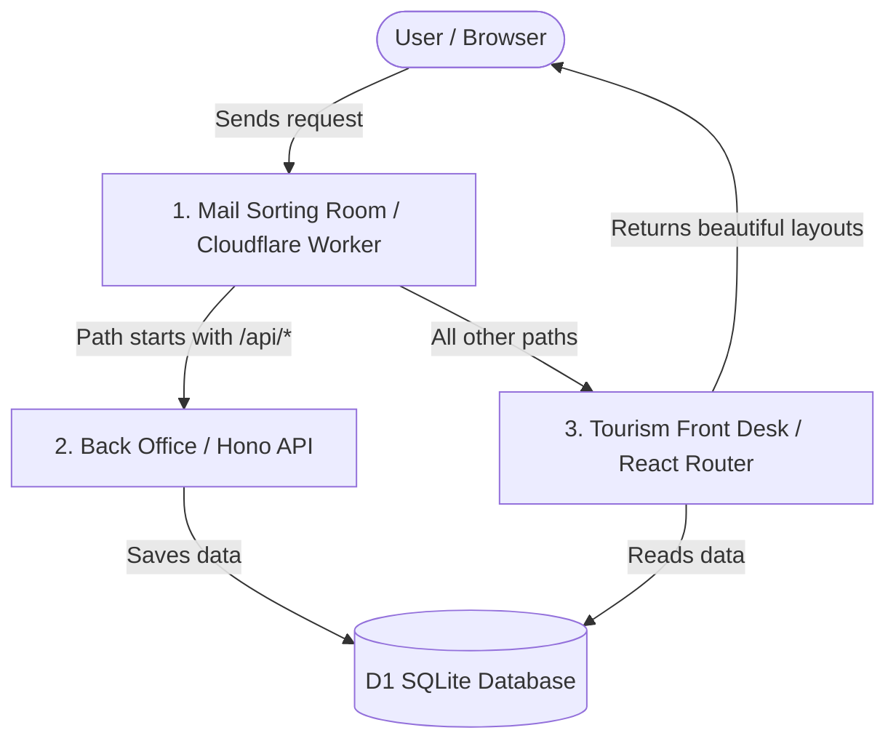
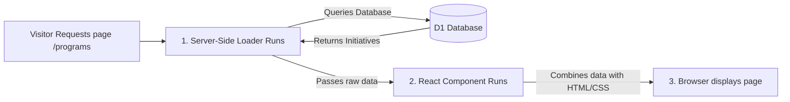
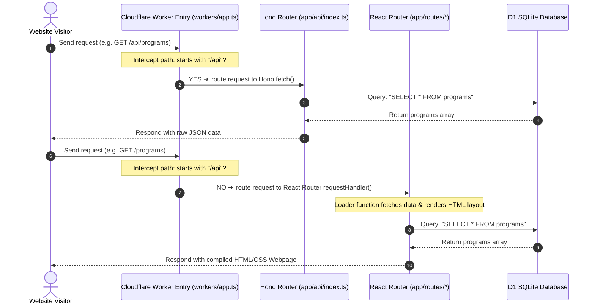

# How React Router (Frontend) & Hono (Backend) Work Together on Cloudflare

This guide explains how the two main frameworks in your project (React Router v7 for the frontend and Hono for the backend) operate individually and collaborate inside the Cloudflare Workers runtime environment. 

We will use simple analogies, diagrams, and explanations so you can easily understand the flow of information.

---

## 1. The Town Mailroom Analogy (How They Work Together)

Imagine your website deployment on Cloudflare is a **Town Hall** that citizens (users) interact with.



### 1. The Mail Sorting Room (Cloudflare Worker)
*   **The Role**: When a citizen (user) sends a letter (request) to the Town Hall, it always arrives here first.
*   **The Action**: The clerk looks at the address on the envelope:
    *   If the address starts with `/api` (e.g. `/api/donate/checkout`), the clerk passes the envelope to the **Back Office (Hono)**.
    *   If the address is anything else (e.g. `/about` or `/blog`), the clerk passes the envelope to the **Tourism Front Desk (React Router)**.

### 2. The Back Office (Hono Backend)
*   **The Role**: Handles administrative operations behind closed doors.
*   **The Action**: Hono doesn't care about visual appearances. If the user wants to volunteer, Hono receives the text details, files them in the **Filing Cabinet (D1 database)**, and returns a simple slip saying "Success." If they want to donate, it contacts Stripe and returns a secure payment link.

### 3. The Tourism Front Desk (React Router Frontend)
*   **The Role**: The public face of the Town Hall.
*   **The Action**: React Router is responsible for visual styling. It queries the Filing Cabinet (D1) to get information, arranges it beautifully using color schemes and layout blocks (Tailwind CSS), and sends a gorgeous, readable web page back to the citizen.

---

## 2. Under the Hood: React Router v7 (Frontend)

React Router v7 acts as your **Single Page Application (SPA)** and **Server-Side Renderer (SSR)**.

### How it Renders Pages (Loaders & Components)
Every page file in your [app/routes/](file:///c:/Biaferose/Maben/Sheikha/Antigravity/NGO/app/routes/) folder has two main parts that run in order:



1.  **The Server Loader (`export async function loader()`)**:
    *   Runs **only on the server** (inside the Cloudflare Worker).
    *   Connects directly to your database and pulls down files before the webpage is shown.
2.  **The Visual Component (`export default function Page()`)**:
    *   Runs on the server first (to output the starting HTML) and then loads in the visitor's browser.
    *   It takes the raw data fetched by the loader and structures it in visual boxes using Tailwind CSS classes.

---

## 3. Under the Hood: Hono (Backend API)

**Hono** (which means "connection" or "harmony" in Japanese) is a lightweight, ultra-fast web framework built specifically for serverless edge runtimes like Cloudflare Workers.

### Why use Hono instead of Node.js/Express?
*   **Web Standard APIs**: Traditional backend frameworks (like Express.js) depend on Node.js-specific modules (like `http` or `fs`). These do not run natively inside Cloudflare Workers. Hono is built entirely on standard Web APIs (`fetch`, `Request`, `Response`, `Headers`), allowing it to execute instantly on Cloudflare edge servers.
*   **Sleek Routing**: Hono allows us to define API routes under `/api/*` in a clean, readable layout. It manages request payloads (`c.req.json()`) and outputs JSON answers (`c.json(...)`) in a few lines of code.

---

## 4. The Cloudflare Workers Routing Hook

Both frameworks are bundled into a single file and deployed as one Cloudflare Worker. The script that connects them is [workers/app.ts](file:///c:/Biaferose/Maben/Sheikha/Antigravity/NGO/workers/app.ts).

Here is exactly how the routing flow executes:



### Explaining the code in `workers/app.ts`:

```typescript
import { createRequestHandler } from "react-router";
import api from "../app/api"; // 1. Import Hono API

// 2. Initialize the React Router server request handler
const requestHandler = createRequestHandler(
  () => import("virtual:react-router/server-build"),
  import.meta.env.MODE,
);

export default {
  // 3. Cloudflare Workers trigger this fetch function for every request
  async fetch(request, env, ctx) {
    const url = new URL(request.url);
    
    // 4. If URL starts with "/api", bypass React Router and go to Hono API
    if (url.pathname.startsWith("/api")) {
      return api.fetch(request, env, ctx);
    }

    // 5. Otherwise, pass the request to React Router to serve web pages
    return requestHandler(request, env, ctx);
  },
} satisfies ExportedHandler<Env>;
```

### Key take-away:
By utilizing this setup, you have **one single application** that manages both frontend page views and backend database APIs. They are built together, deployed together, and run inside the same global edge runtime, keeping performance high and hosting costs completely free.
