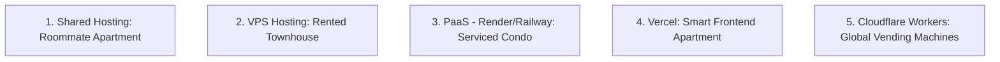

# The Complete Web Hosting Manual & Cloudflare Deep-Dive

This guide is written specifically for beginners who have never hosted a website before. It explains the hosting landscape, compares different hosting models, and provides an in-depth understanding of the technologies powering your Cloudflare-deployed EcoAlliance NGO website.

---

## Part 1: The Hosting Landscape (Comparing Hosting Models)

To understand web hosting, imagine your website's code is a **physical store** that you want to open. You need space, resources, and utilities. Different hosting models represent different types of property rentals.



### 1. Shared Hosting (e.g., Bluehost, HostGator)
*   **The Analogy**: Renting a single room in an apartment building and sharing the kitchen, bathroom, and utilities with 100 other roommates.
*   **How it works**: A hosting company puts hundreds of websites on a single physical computer server. 
*   **The Catch**: If one of your roommates (another website on the server) gets a massive spike in traffic, it consumes all the CPU/RAM memory, making your website crash or slow to a crawl.
*   **Best for**: Simple, static WordPress blogs with low traffic.

### 2. VPS Hosting (Virtual Private Server - e.g., DigitalOcean, Linode)
*   **The Analogy**: Renting an empty townhouse. You are responsible for painting, fixing the plumbing, and setting up the locks.
*   **How it works**: You rent a dedicated slice of a server. You get your own Operating System (usually Linux).
*   **The Catch**: You must be a system administrator. You have to manually install security patches, set up firewall rules, and configure web servers (like Nginx). If your server runs out of RAM, it crashes.
*   **Best for**: Systems administrators who need full control over the environment.

### 3. Container PaaS (Platform as a Service - e.g., Render, Railway, Heroku)
*   **The Analogy**: Renting a fully serviced condo where the landlord handles utilities, trash, and maintenance, but you still live in one specific building.
*   **How it works**: They package your app inside a virtual container (like Docker) and run it on their cloud. You don't manage the operating system, just your code.
*   **The Catch**: **Cold Starts**. To save money, free-tier containers "go to sleep" if no one visits for 15 minutes. When a new visitor arrives, it takes 5 to 15 seconds for the container to "boot up" (known as a cold start), causing a frustrating delay.
*   **Best for**: Full-stack Node/Python/Ruby databases and API backends.

### 4. Frontend PaaS (e.g., Vercel, Netlify)
*   **The Analogy**: A modern, high-tech apartment optimized specifically for modern frontend frameworks (like Next.js or React).
*   **How it works**: Optimized for server-side rendered (SSR) Javascript. It compiles your code, distributes it on CDNs (Content Delivery Networks), and runs server logic inside serverless functions.
*   **The Catch**: Can get very expensive once you exceed their free tiers, especially regarding bandwidth/egress fees (charging you when people download files from your site).
*   **Best for**: Next.js and frontend React applications.

### 5. Serverless Edge Networks (Cloudflare Workers & Pages)
*   **The Analogy**: Instead of building a store in one city, you put **digital vending machines** in 300+ cities globally. If someone in Tokyo wants a soda, they get it from the Tokyo vending machine instantly.
*   **How it works**: Your code doesn't live on one server. It is copied to Cloudflare's global edge network. When a user requests your site, the server closest to them builds and serves the page.
*   **Benefits**: Zero cold starts, automatic scaling to millions of hits, and 100% free for small-to-medium sites.

---

### Hosting Models Comparison Table

| Metric | Shared Hosting | VPS Hosting | Container PaaS (Render/Railway) | Frontend PaaS (Vercel) | Cloudflare Edge (Workers/Pages) |
| :--- | :--- | :--- | :--- | :--- | :--- |
| **Setup Difficulty** | Easy | Very Hard (Linux Cmds) | Easy | Very Easy | **Easy** (Wrangler CLI) |
| **Speed (Latency)** | Slow (Single Server) | Medium | Medium (Single Zone) | Fast (Global CDN) | **Instant** (Local Edge Run) |
| **Scaling** | Poor | Manual | Auto (Expensive) | Auto | **Instant & Auto** (Free) |
| **Cold Starts** | None | None | **Slow (5-15 sec on free)** | Minimal | **None (< 1ms boot)** |
| **Cost** | Cheap ($3-$10/mo) | Medium ($5-$80/mo) | Free to Paid | Free (High paid scale) | **100% Free Tier** (No Card Needed) |

---

## Part 2: In-Depth Cloudflare Technologies

Your project uses **Cloudflare Pages & Workers** together. Here is how they operate under the hood:

### 1. The V8 Isolate Technology (Why Workers are so Fast)
Traditional hosting (Render, Railway, VPS) uses **Virtualization** (Virtual Machines or Docker Containers). Every container is a mini-computer running a cut-down operating system. Booting this virtual computer takes time (Cold Starts).

Cloudflare Workers does **not** use containers. Instead, it uses **V8 Isolates**:
*   **Google Chrome Engine**: V8 is the exact engine built by Google to run JavaScript inside the Chrome browser. 
*   **Lightweight Isolates**: Instead of booting a whole virtual operating system, Cloudflare spins up a new V8 Isolate—a tiny sandbox that executes your JavaScript code. 
*   **Speed**: Booting a V8 Isolate takes **under 1 millisecond** (compared to 10 seconds for a Docker container). This completely eliminates cold starts.
*   **Memory Efficiency**: Hundreds of thousands of V8 Isolates can run on a single physical server securely, which is why Cloudflare can offer a massive free tier.

```text
Traditional Containers (Render/Railway):
[ Operating System ] ➔ [ Virtual RAM/CPU ] ➔ [ Node.js Runtime ] ➔ [ Your Code ] (Heavy, 10s Boot)

Cloudflare Workers (V8 Isolates):
[ V8 JS Engine ] ➔ [ Isolate Sandbox 1: Your Code ] (Ultra-Lightweight, <1ms Boot)
```

### 2. Edge Computing & CDNs
Normally, when a visitor accesses a website, their browser sends a request across the ocean to a database in Virginia, waits for the page to be built, and sends it back.

With Cloudflare:
1.  **Static Assets (CSS, JS, Images)** are hosted on Cloudflare **Pages** and cached on 300+ data centers.
2.  **Compute (Workers)** executes your Remix loader and Hono API directly at the data center closest to the user (the "Edge").
3.  Latency drops from 300ms to 10ms, making your NGO website load instantly anywhere on Earth.

---

## Part 3: Database & Storage on the Edge (D1)

### 1. Cloudflare D1 (SQLite)
Your database is **Cloudflare D1**. It uses SQLite, a serverless SQL database engine.
*   **D1 replication**: While traditional databases are centralized, Cloudflare D1 reads/writes database rows close to where your Worker is running.
*   **Free limits**: D1 provides up to **5GB of free storage**, which can hold millions of text entries (like volunteer records or blog articles).

### 2. Why We Stored Images as Base64 in D1 (Instead of R2)
Cloudflare has an object storage service called **R2** (similar to Amazon S3) for storing images.
*   **The Catch**: To prevent abuse and spam, Cloudflare requires you to link a **credit card or PayPal** to activate R2, even though it has a generous free tier of 10GB.
*   **Our Solution (Base64)**: We bypassed R2 completely. When an administrator uploads an image in `/admin`, your code reads the file and converts the binary image into a **Base64 text string** (a string beginning with `data:image/jpeg;base64,...`). 
*   We save this text string directly in your D1 SQLite database.
*   **Benefit**: This makes your app **100% card-free** during setup and deployment. You do not need to input any billing information on Cloudflare.

---

## Part 4: Key Behaviours and Rules for Cloudflare Workers

1.  **Read-Only Filesystem**: Cloudflare Workers run in a serverless environment. You **cannot** save files directly to the server disk (e.g. you can't run `fs.writeFile('image.jpg')`). Any permanent data must go into **D1 Database**.
2.  **No Node.js Globals**: Standard Node.js library calls (like `process` or heavy filesystem APIs) do not run natively on Workers. Instead, Workers use standard browser-like APIs (like `Fetch`, `Headers`, and `Request`). Your Hono API and React Router configurations are written specifically to use these standard Web APIs.
3.  **Global Bindings**: wrangler binds resources (D1) using environment variables. In your code, you access the database using `env.DB` directly.
