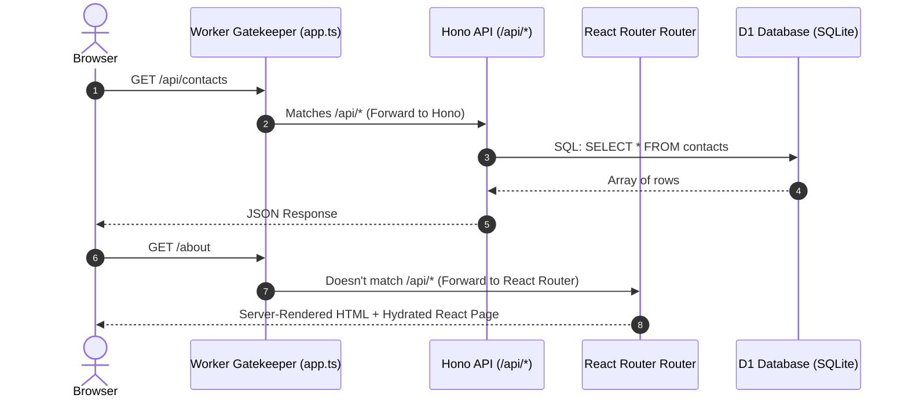

# MERN to Cloudflare Edge: The Ultimate Transition Guide (React + Hono + D1)

Welcome! If you have built web applications using the **MERN Stack** (MongoDB, Express, React, Node.js), you already understand the fundamentals of full-stack development. This guide is designed to translate your existing MERN knowledge into the **Cloudflare Edge Stack** (React Router v7, Hono, D1 Database, and Wrangler).

By the end of this guide, you will know how to develop, test, and deploy a full-stack React + Hono application running entirely on Cloudflare's global edge network.

---

## 🗺️ Architectural Concept Map: MERN vs. Cloudflare

To start, let's look at how the components of your MERN stack map to the Cloudflare ecosystem:

| Concept | Traditional MERN Stack | Cloudflare Edge Stack | Key Architectural Difference |
| :--- | :--- | :--- | :--- |
| **Database (M)** | **MongoDB** (NoSQL / Documents) | **Cloudflare D1** (SQLite / SQL Tables) | MongoDB connects via persistent TCP sockets. D1 is stateless, running SQLite on the edge, queried over low-latency HTTP bindings. |
| **Backend API (E)** | **Express.js** (Node.js runtime) | **Hono** (Web Standards / Worker runtime) | Express relies on heavy Node-specific APIs (`http`, `fs`). Hono is built on global Web APIs (`Request`, `Response`, `Fetch`) and weighs less than 15KB. |
| **Frontend (R)** | **React SPA** (Client-rendered, CSR) | **React Router v7** (SSR + SPA Hydration) | MERN serves static React assets. React Router v7 pre-renders React pages directly on the edge for instant loading and perfect SEO. |
| **Runtime (N)** | **Node.js** (Running 24/7 on a VPS / Heroku) | **Cloudflare Workers** (V8 Isolates engine) | VPS servers are always on and bill for idle time. Cloudflare Workers run inside lightweight V8 sandboxes that start in 0ms and scale automatically. |

---

## ⚡ The Edge Paradigm Shifts: What You Must Know

As a MERN developer, there are three main changes in mindset you need to make when moving to Cloudflare Workers:

### 1. Stateless Execution (No Persistent Connections)
*   **MERN**: Your Express server starts up on a server and keeps a continuous connection pool open to MongoDB (e.g., `mongoose.connect()`).
*   **Cloudflare**: Workers are stateless and short-lived. When a request comes in, a Worker spins up, queries the database, sends the response, and immediately suspends. You do not manage connection pools, sockets, or persistent states.

### 2. Node.js vs. Web-Standard APIs
*   **MERN**: You use Node.js globals like `process.env`, `Buffer`, or built-in modules like `path` and `fs`.
*   **Cloudflare**: Workers do not run on Node.js; they run on the V8 engine using standard web APIs. Instead of `process.env`, environment variables are passed to your handler in an `env` object. Instead of `Buffer`, you use standard `Uint8Array`, `ArrayBuffer`, or the Web Crypto API.

### 3. Document-Based NoSQL vs. Relational SQL
*   **MERN**: You store data as JSON-like documents with flexible schemas. Relations are often handled by nesting objects or using `.populate()`.
*   **Cloudflare**: Cloudflare D1 uses SQL (SQLite). You must design structured tables, declare columns and data types (TEXT, INTEGER, REAL, BLOB), and write SQL queries (`SELECT`, `INSERT`, `JOIN`).

---

## 🛠️ Step 1: Scaffolding a New Cloudflare Project

To build a co-located React frontend and Hono backend, we use a single mono-repo structure. Let's look at how we initialize and structure this project.

### 1. Initialize the React Router v7 Project
We run the standard React Router initializer. Since we are deploying to Cloudflare, we tell the setup to prepare the project for Cloudflare Workers/Pages.

```bash
npx create-react-router@latest my-cloudflare-app
cd my-cloudflare-app
```

### 2. Install Hono
Install Hono as your lightweight backend router:

```bash
npm install hono
```

### 3. Folder Layout
Here is how your project is structured when combining React and Hono:

```text
my-cloudflare-app/
├── .wrangler/                  # Wrangler's local state (databases, configs)
├── app/                        # React Frontend
│   ├── routes/                 # Frontend Routes (Pages)
│   │   ├── home.tsx            # Home Page
│   │   └── admin.tsx           # Admin Page
│   ├── root.tsx                # Main Layout and Navigation
│   └── routes.ts               # URL mapping configuration for React Router
├── workers/                    # Backend Gatekeeper & API
│   └── app.ts                  # Worker Entrypoint: Hono backend + React Router handler
├── wrangler.jsonc              # Cloudflare configuration file
├── schema.sql                  # Database Schema
├── seed.sql                    # Initial Database seed data
├── package.json
└── vite.config.ts              # Vite Bundler configurations
```

---

## 💾 Step 2: Database Setup & Local SQLite Emulation

In the MERN stack, you run MongoDB locally (via Docker, MongoDB Community Server, or Mongo Atlas). In the Cloudflare stack, we use **Cloudflare D1**, which runs **SQLite** under the hood.

> [!NOTE]
> **No installation required!** You do not need to install SQLite on your computer. When you run Wrangler (Cloudflare's developer CLI), it automatically creates and emulates an SQLite database inside your project's `.wrangler/` folder.

### 1. Configure Wrangler
In your `wrangler.jsonc` (or `wrangler.toml`), declare your D1 database binding:

```jsonc
{
  "name": "my-cloudflare-app",
  "compatibility_date": "2026-06-11",
  "main": "./workers/app.ts", // Points to our Worker entrypoint
  "assets": {
    "directory": "./build/client" // Serves static frontend assets
  },
  "d1_databases": [
    {
      "binding": "DB", // The variable name we access in our code: c.env.DB
      "database_name": "app-db",
      "database_id": "9e0a8857-98ed-4d8d-ab55-29374a4b3f8b" // Obtained from Cloudflare dashboard
    }
  ]
}
```

### 2. Define the Schema (`schema.sql`)
Instead of Mongoose schemas, you define your tables in raw SQL. Create a `schema.sql` file at the root:

```sql
-- schema.sql
DROP TABLE IF EXISTS articles;
DROP TABLE IF EXISTS contacts;

CREATE TABLE contacts (
    id INTEGER PRIMARY KEY AUTOINCREMENT,
    name TEXT NOT NULL,
    email TEXT NOT NULL UNIQUE,
    message TEXT,
    created_at DATETIME DEFAULT CURRENT_TIMESTAMP
);

CREATE TABLE articles (
    id INTEGER PRIMARY KEY AUTOINCREMENT,
    title TEXT NOT NULL,
    slug TEXT NOT NULL UNIQUE,
    content TEXT NOT NULL,
    image_base64 TEXT, -- Storing images as Base64 bypasses complex bucket setups!
    published_at DATETIME DEFAULT CURRENT_TIMESTAMP
);
```

### 3. Initialize & Seed the Database (Locally)
Wrangler manages your local database. When you run Wrangler database commands with the `--local` flag, it creates SQLite database files on your machine.

Run this command to execute the SQL file on your local database emulator:

```bash
npx wrangler d1 execute app-db --local --file=./schema.sql
```

#### 🔍 Where are these local SQLite files stored?
Wrangler stores the local emulated SQLite database inside your project directory at:
`./.wrangler/state/v3/d1/miniflare-D1DatabaseObject/`

These files are standard SQLite binary files. You do not need to check them into Git (they are added to `.gitignore` automatically). Wrangler reads and writes to them whenever you run `npm run dev`.

---

## ⚡ Step 3: Writing the Hono Backend Router

Hono looks and feels exactly like Express, but it uses web standard signatures. Instead of `(req, res)` callbacks, Hono handlers take a context object `c`.

### 1. Creating the API Server
Let's look at a typical Express API endpoint vs. its Hono counterpart.

#### Express (MERN):
```javascript
// Express.js
app.post('/api/contacts', async (req, res) => {
  try {
    const { name, email, message } = req.body;
    const contact = new Contact({ name, email, message });
    await contact.save();
    res.status(201).json({ success: true, id: contact._id });
  } catch (err) {
    res.status(500).json({ error: err.message });
  }
});
```

#### Hono (Cloudflare Workers):
In Cloudflare Workers, the environment variables and database bindings (e.g., `DB`) are attached to the request context inside `c.env`.

```typescript
// workers/app.ts
import { Hono } from 'hono';
import { cors } from 'hono/cors';

// Define the environment bindings type (D1, secrets, etc.)
type Bindings = {
  DB: D1Database;
  JWT_SECRET: string;
};

const app = new Hono<{ Bindings: Bindings }>();

// Middleware: Enable CORS (equivalent to app.use(cors()) in Express)
app.use('/api/*', cors());

// API Route: Create a new contact
app.post('/api/contacts', async (c) => {
  try {
    // In Hono, we parse JSON body using c.req.json() instead of req.body
    const { name, email, message } = await c.req.json();
    
    // We execute SQL statements using D1's prepare and run methods.
    // Use binding '?' placeholders to automatically prevent SQL injections.
    const result = await c.env.DB.prepare(
      "INSERT INTO contacts (name, email, message) VALUES (?, ?, ?)"
    )
      .bind(name, email, message)
      .run();

    return c.json({ 
      success: true, 
      message: "Contact submitted!",
      id: result.meta.last_row_id 
    }, 201);
  } catch (err: any) {
    return c.json({ success: false, error: err.message }, 500);
  }
});

// API Route: Fetch all contacts
app.get('/api/contacts', async (c) => {
  const { results } = await c.env.DB.prepare(
    "SELECT * FROM contacts ORDER BY created_at DESC"
  ).all();
  
  return c.json(results);
});

export default app;
```

---

## 🎨 Step 4: Connecting the React Frontend

In MERN, you build the React app, run `npm run build`, and Express serves those static files or they are deployed to a host like Vercel/Netlify. In Cloudflare Pages, React and Hono are co-located. The Worker acts as a gatekeeper: it routes `/api/*` requests to Hono and all other routes to React Router for Server-Side Rendering (SSR) or SPA hydration.

Here is how the request flow works:



### 1. Wiring the Entrypoint (`workers/app.ts`)
To configure this gatekeeper architecture, modify the entrypoint to merge Hono routes with React Router:

```typescript
// workers/app.ts
import { Hono } from 'hono';
// @ts-ignore - react-router build outputs this handler
import * as build from "../build/server/index.js";
import { createRequestHandler } from "react-router";

type Bindings = {
  DB: D1Database;
};

const app = new Hono<{ Bindings: Bindings }>();

// --- 1. Define Hono API Endpoints ---
app.get('/api/health', (c) => c.json({ status: "healthy" }));

app.get('/api/blogs', async (c) => {
  const { results } = await c.env.DB.prepare("SELECT * FROM articles").all();
  return c.json(results);
});

// --- 2. Fallback: Route all other requests to React Router ---
const reactRouterHandler = createRequestHandler(build, import.meta.env.MODE);

app.all('*', async (c) => {
  // Pass the D1 database and other bindings to React Router's Load Context
  return reactRouterHandler(c.req.raw, {
    cloudflare: {
      env: c.env,
      ctx: c.executionCtx
    }
  });
});

export default app;
```

### 2. Loading Data in React Router (v7 Server Loaders)
Instead of calling `useEffect` and `fetch('/api/blogs')` when the component mounts, React Router lets you fetch data on the server *before* rendering the component. This gives users immediate content without loading states.

```tsx
// app/routes/blogs.tsx
import { useLoaderData, Link } from "react-router";
import type { Route } from "./+types/blogs";

// 1. The Loader runs on the server (Worker Edge) before rendering
export async function loader({ context }: Route.LoaderArgs) {
  // Access D1 from the Cloudflare Load Context we passed in app.ts
  const db = context.cloudflare.env.DB;
  
  const { results } = await db.prepare(
    "SELECT id, title, slug, published_at FROM articles ORDER BY published_at DESC"
  ).all();

  return { articles: results };
}

// 2. The React component receives the loader data directly
export default function Blogs({ loaderData }: Route.ComponentProps) {
  const { articles } = loaderData;

  return (
    <div className="max-w-4xl mx-auto py-10 px-4">
      <h1 className="text-3xl font-bold mb-6 text-slate-900">Our Blog Articles</h1>
      {articles.length === 0 ? (
        <p className="text-slate-500">No articles found.</p>
      ) : (
        <div className="grid gap-6">
          {articles.map((article: any) => (
            <div key={article.id} className="p-6 border rounded-lg hover:shadow-md transition">
              <h2 className="text-xl font-semibold text-emerald-700">
                <Link to={`/blog/${article.slug}`}>{article.title}</Link>
              </h2>
              <p className="text-sm text-slate-500 mt-2">
                Published on: {new Date(article.published_at).toLocaleDateString()}
              </p>
            </div>
          ))}
        </div>
      )}
    </div>
  );
}
```

---

## 🔒 Step 5: Handling Authentication (JWT on the Edge)

In MERN, you use `bcryptjs` and `jsonwebtoken`. Because these libraries rely on Node.js core modules, they run slowly or fail to compile on the V8 Worker runtime. Instead, we use modern, edge-compatible equivalents.

*   Instead of `bcrypt`, we use the **Web Crypto API** (standard inside browsers and Workers) to hash credentials using PBKDF2 or SHA-256.
*   Instead of `jsonwebtoken`, we use Hono's built-in `hono/jwt` module or `jose`.

### Example: Creating & Verifying JWT in Hono

```typescript
import { Hono } from 'hono';
import { sign, verify } from 'hono/jwt';

const app = new Hono<{ Bindings: { JWT_SECRET: string } }>();

// 1. Generate JWT Token on Successful Login
app.post('/api/login', async (c) => {
  const { email, password } = await c.req.json();

  // Simple password check (replace with Web Crypto comparison in real apps)
  if (email === "admin@example.com" && password === "supersecret") {
    const payload = {
      email,
      role: 'admin',
      exp: Math.floor(Date.now() / 1000) + 60 * 60, // Expire in 1 hour
    };
    
    // Sign the token using the secret key bound to c.env
    const token = await sign(payload, c.env.JWT_SECRET);
    return c.json({ success: true, token });
  }

  return c.json({ success: false, error: "Invalid credentials" }, 401);
});

// 2. Middleware to Protect Routes
app.use('/api/admin/*', async (c, next) => {
  const authHeader = c.req.header('Authorization');
  if (!authHeader || !authHeader.startsWith('Bearer ')) {
    return c.json({ error: "Unauthorized" }, 401);
  }

  const token = authHeader.split(' ')[1];
  try {
    const payload = await verify(token, c.env.JWT_SECRET);
    c.set('jwtPayload', payload); // Store the payload to use in subsequent handlers
    await next();
  } catch (err) {
    return c.json({ error: "Invalid or expired token" }, 401);
  }
});
```

---

## 🚀 Step 6: Deployment Guide to Cloudflare Production

When you are ready to push your application live, follow this checklist to create your databases, configure secrets, and deploy.

### 1. Log In to Wrangler
Authenticate your local command line with your Cloudflare account:

```bash
npx wrangler login
```
This will open your browser and ask you to log in to your Cloudflare account and authorize the CLI.

### 2. Create the Production D1 Database
Create the database on your Cloudflare account:

```bash
npx wrangler d1 create app-db
```
This command outputs configuration details, including a **Database ID (UUID)**.

### 3. Update your `wrangler.jsonc`
Replace the placeholder database ID with your real database UUID in `wrangler.jsonc`:

```jsonc
"d1_databases": [
  {
    "binding": "DB",
    "database_name": "app-db",
    "database_id": "paste-your-new-uuid-here"
  }
]
```

### 4. Create the Tables in Production (Remote)
Run your schema script against the database in Cloudflare's cloud environment using the `--remote` flag:

```bash
npx wrangler d1 execute app-db --remote --file=./schema.sql
```

### 5. Set Environment Secrets
For API keys, JWT secrets, or payment credentials (like Stripe Keys), do not put them in your configuration files. Use Wrangler's secret manager to upload them securely:

```bash
npx wrangler secret put JWT_SECRET
```
You will be prompted to enter the secret value in the terminal.

### 6. Compile & Deploy the Project
Now, build the frontend bundles and publish the worker using the deploy script:

```bash
npm run deploy
```
Wrangler will bundle your React frontend assets, compile your Hono API, configure D1 bindings, and host your entire website on a free `*.workers.dev` subdomain!

---

## 📝 Developer Cheat Sheet: MERN to Cloudflare

### Database Commands:
*   **Create Local DB Tables**: `npx wrangler d1 execute <db-name> --local --file=./schema.sql`
*   **Seed Local DB Data**: `npx wrangler d1 execute <db-name> --local --file=./seed.sql`
*   **View Local Database CLI Console**: `npx wrangler d1 execute <db-name> --local --command="SELECT * FROM users"`
*   **Create Production DB Tables**: `npx wrangler d1 execute <db-name> --remote --file=./schema.sql`

### Syntax Comparison:

#### Database Fetch:
*   **Mongoose**: `const users = await User.find({ role: 'admin' });`
*   **D1 SQL**: `const { results } = await c.env.DB.prepare("SELECT * FROM users WHERE role = ?").bind('admin').all();`

#### Parse Request Body:
*   **Express**: `const data = req.body;`
*   **Hono**: `const data = await c.req.json();`

#### URL Route Parameters:
*   **Express**: `const id = req.params.id;` (mapped to `/api/users/:id`)
*   **Hono**: `const id = c.req.param('id');` (mapped to `/api/users/:id`)

#### Send JSON Response:
*   **Express**: `res.status(200).json({ status: 'ok' });`
*   **Hono**: `return c.json({ status: 'ok' }, 200);`

---

## ⚠️ Common Pitfalls & How to Avoid Them

### ❌ Error: `process is not defined`
*   **Why**: Workers use Web API standards, not Node.js. `process` does not exist.
*   **Fix**: Instead of `process.env.MY_SECRET`, access variables via `c.env.MY_SECRET` in Hono, or `context.cloudflare.env.MY_SECRET` inside React loaders/actions.

### ❌ Error: `Buffer is not defined`
*   **Why**: Node's `Buffer` class is missing in standard V8 runtimes.
*   **Fix**: For string-to-base64 conversions, use:
    ```typescript
    // Convert Uint8Array/ArrayBuffer to Base64
    const base64 = btoa(String.fromCharCode(...new Uint8Array(arrayBuffer)));
    ```

### ⏱️ D1 Query Limitations
*   Unlike heavy SQL engines like PostgreSQL, D1 runs SQLite. It is extremely fast for reads, but writes must run sequentially.
*   Ensure that you do not run infinite loops or overly complex write operations on the edge. Store larger images or binaries as Base64 text up to a few megabytes inside D1, or use **Cloudflare R2** buckets for files larger than 5MB.
