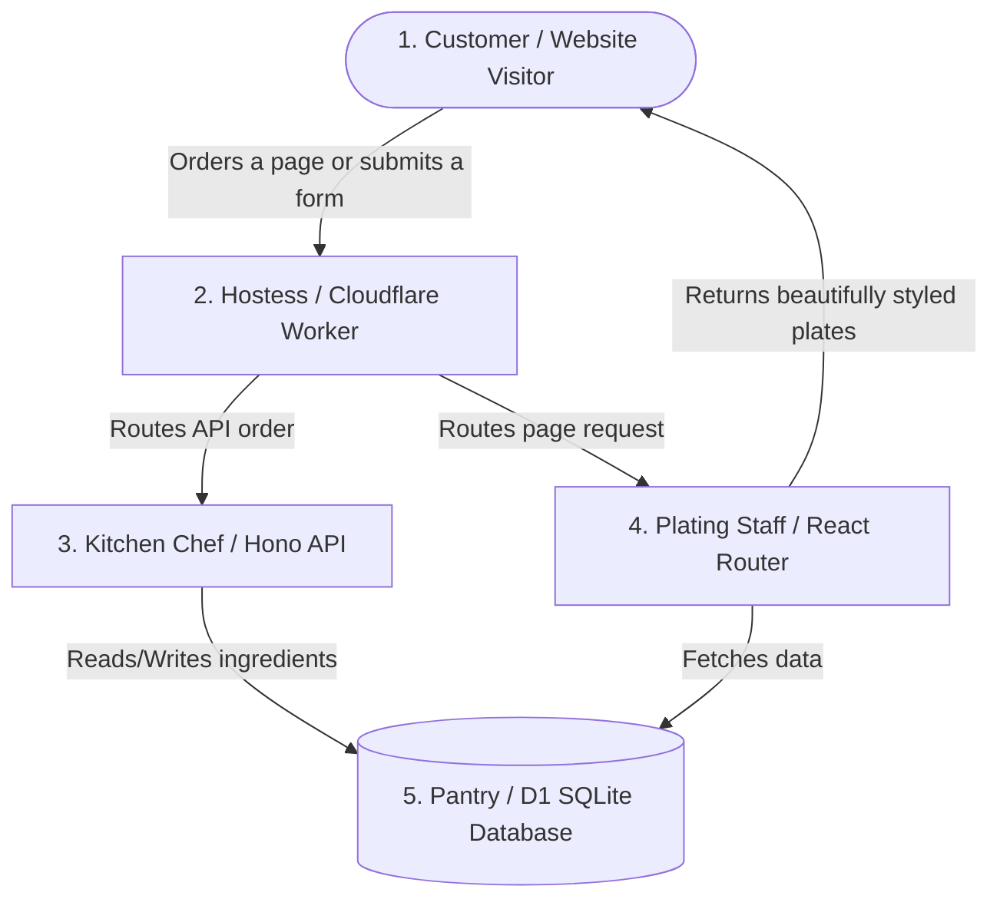
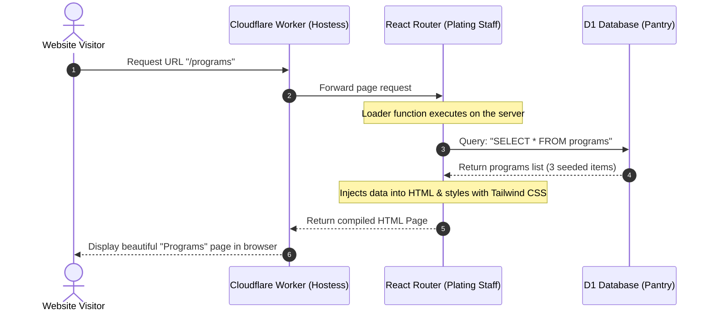
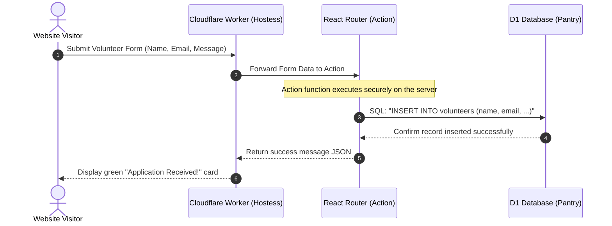
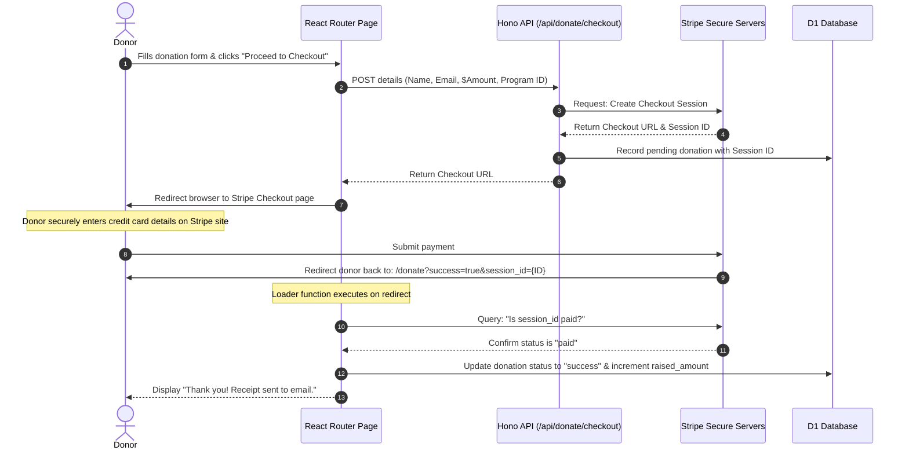
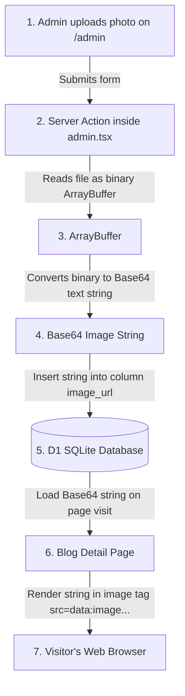

# EcoAlliance: System Architecture & Data Flows

This guide explains how your website operates under the hood. It uses simple analogies and visual diagrams so that anyone, regardless of technical background, can understand how requests travel, how data is saved, and how Stripe payments work.

---

## 1. The Core Components: A Restaurant Analogy

Think of your website as a modern restaurant. Here is how the components map to a dining experience:

1.  **The Customer (Website Visitor)**: The person browsing your site, clicking buttons, submitting contact forms, or donating.
2.  **The Hostess (Cloudflare Worker)**: The entry point. It greets every request and decides where it should go. 
    *   If the user wants an API action (like processing a payment), it sends the request to the Chef.
    *   If the user wants to see a page (like the Home or About page), it sends the request to the Plating Staff.
3.  **The Chef (Hono API Backend)**: The engine that processes logic. It deals with raw data, creates Stripe sessions, and stores messages. It doesn't make things look pretty; it just cooks the data.
4.  **The Plating Staff (React Router Frontend)**: Takes raw data from the database, combines it with your layouts and Tailwind CSS styling, and turns it into a beautiful web page to serve back to the visitor.
5.  **The Pantry (D1 Database)**: A global, serverless SQLite database where all structured records (programs list, blog articles, contact logs, volunteer applications) are safely stored.

---

## 2. Request-Response Flow: How Pages Load

When a visitor clicks on `ecoalliance.org/programs`, here is how the data flows:

1.  The visitor enters the `/programs` URL.
2.  Cloudflare Worker intercepts the request and forwards it to React Router.
3.  React Router runs a **Loader** (a server function that runs before the page displays) to fetch active initiatives.
4.  The D1 database returns the list of programs.
5.  React Router combines the program data with your Tailwind CSS templates to generate standard HTML.
6.  The browser receives the HTML and displays it to the user.

---

## 3. Form Submission Flow: How Volunteers Sign Up

When a visitor fills out the volunteer form, the system processes it without reloading the entire page:

1.  The user clicks **Submit Application**.
2.  The form data is sent to a server-side **Action** function inside your React Router files.
3.  The Action securely inserts the volunteer's details into the D1 database.
4.  Once database writes succeed, a success confirmation is returned.
5.  The website page updates dynamically, hiding the form and showing the green "Thank You" banner.

---

## 4. Stripe Donation Flow (No Webhooks)

Here is how the donation flow works using only your Stripe Secret Key (no complicated webhook scripts required):

1.  The donor fills out the details and submits.
2.  The frontend routes the request to our Hono API backend.
3.  Hono connects to Stripe and requests a Checkout session.
4.  Stripe returns a unique checkout session and URL.
5.  Hono logs the transaction in the database as **pending** and sends the checkout URL back.
6.  The browser redirects the donor to Stripe's secure payment portal.
7.  The donor pays. Stripe redirects the donor back to your page with `?success=true&session_id=...` in the link.
8.  Your page **Loader** runs instantly, talks to Stripe directly using your secret key to verify the payment, updates the database status to **success**, and increases the program's funded counter.

---

## 5. R2-Free Image Upload Flow (Base64)

This diagram shows how you upload cover photos directly into the D1 database as Base64 strings without setting up a billing account:

1.  **Form Upload**: The administrator selects a JPEG or PNG file.
2.  **Conversion**: The server Action reads the image file as binary data (an ArrayBuffer) and encodes it into a Base64 text string (looks like `data:image/jpeg;base64,abcde123...`).
3.  **Storage**: The Base64 text string is written directly into the `image_url` column of the `blog_posts` table inside D1 SQLite.
4.  **Display**: When a visitor views the blog post, the browser reads the Base64 string directly inside standard image tags (``) and renders the image natively, avoiding any external file hosters.
